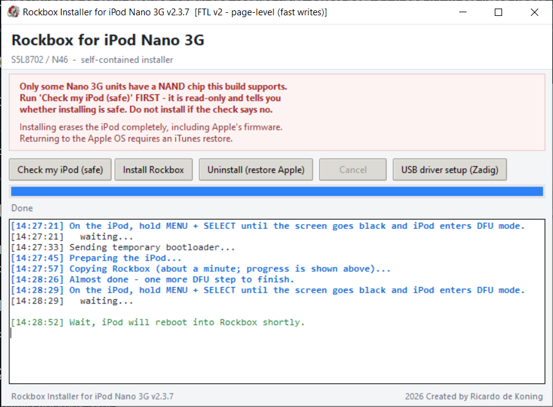
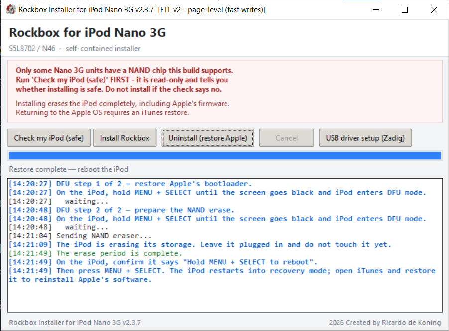
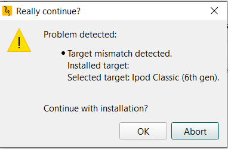

# Rockbox for the iPod Nano 3G

Run [Rockbox](https://www.rockbox.org/) — the open-source music firmware — on
the **iPod Nano 3rd generation** (the "fat" Nano, 2007, model N46). This is a
community port with a simple Windows app that installs it for you.

> ⚠️ **Installing replaces Apple's software.** It reformats the iPod's storage,
> which removes Apple's OS and everything on the device. You can go back to
> Apple later ([here's how](port-docs/GOING_BACK_TO_APPLE.md)), but it needs
> iTunes. Back up your music first.

---

## Is my iPod supported?

You need an **iPod Nano 3rd generation**. It shipped in **4 GB and 8 GB**
capacities and both are supported. Not sure which iPod you have? It's the
short, wide one with a 2-inch screen, from 2007.

Not every Nano 3G can run this yet: it depends on the exact flash memory chip
inside, which varies between units (capacity does not decide it). The app has a
**"Check my iPod (safe)"** button that reads the chip and tells you — it never
writes anything, so it is safe to run on any unit.

Chips validated so far (Samsung, Hynix and Toshiba units, across both 4 GB and
8 GB) are listed under [Devices used](NANO3G_TEST_UNITS.md).

---

## Get the app

Download the latest installer from the
[Releases page](../../releases), or build it yourself
([instructions](port-docs/BUILDING.md)).

It is a single Windows program — nothing else to install. Right-click it and
choose **Run as administrator** (it needs that to access the iPod's storage).

---

## Using the app

The app has three buttons. It talks you through each step in its log window and
waits for you, so you don't have to time anything by hand.

### 1. Check my iPod (safe)

Reads the flash chip and reports whether your unit is supported. **Read-only —
nothing is written.** Always start here.

### 2. Install Rockbox

Installs Rockbox. When prompted, put the iPod into **DFU mode** by keeping it
plugged in and holding **MENU + SELECT** until the screen goes black. The app
detects DFU automatically and continues on its own: it formats the iPod, copies
Rockbox across, and installs the bootloader. When it finishes, the iPod reboots
into Rockbox.

> This erases the iPod completely, including Apple's software. See the warning
> at the top.

### 3. Uninstall (restore Apple)

Removes Rockbox and erases the storage so you can restore Apple's software with
iTunes. The app walks you through it; when it's done, open iTunes and restore
the iPod. Full details: [Going back to Apple's OS](port-docs/GOING_BACK_TO_APPLE.md).

### Entering DFU mode

Whenever the app asks: keep the iPod plugged in and hold **MENU + SELECT**
until the screen goes completely black. That's DFU mode. You don't need to
unplug anything.

---

## What it looks like

The two main workflows in the app: installing Rockbox, and restoring the iPod
back to Apple's software.

---

## Adding themes and fonts

Once Rockbox is installed and the iPod boots it, you can use the official
[Rockbox Utility](https://www.rockbox.org/wiki/RockboxUtility) to download and
install extra **themes** and **fonts** onto the device.

The Nano 3G is not in Rockbox Utility's device list, but the installed firmware
is compatible with the iPod Classic (6th gen) target for theme and font
installation. So:

1. In Rockbox Utility, select **iPod Classic (6th gen)** as your device.
2. Point it at the iPod's drive and install the themes/fonts you want.
3. It will warn you with a **"Target mismatch detected"** dialog (shown below)
   because you picked the Classic target on a Nano 3G. This is expected —
   click **OK** to continue.

Only use this for **themes and fonts**. Do not use Rockbox Utility to install
the bootloader or the main firmware on the Nano 3G — those are handled by the
app on this page, and the Classic target's versions are not correct for this
device.

---

## More detail

- [Devices used / supported chips](NANO3G_TEST_UNITS.md) — the exact iPod units
  and flash chips this port has been validated on.
- [How storage works (the FTL)](port-docs/FTL_DESIGN.md) — why a Nano 3G needs
  a flash translation layer, and how this one works.
- [NAND chip identification](port-docs/NAND_CHIP_IDENTIFICATION.md) — why each
  flash chip is validated individually, and how that differs from Apple.
- [Going back to Apple's OS](port-docs/GOING_BACK_TO_APPLE.md) — restoring the
  original software.
- [Building from source](port-docs/BUILDING.md) — for developers.
- [Bring-up fixes](port-docs/BRINGUP_FIXES.md) — the defects fixed to make the
  port boot, for anyone doing similar S5L87xx work.

---

## Status

Rockbox boots and runs on real hardware: it plays music, the UI works, and the
device round-trips files reliably over USB. This is a community work in
progress, not an official Rockbox release, and it is provided as-is. Known
limitations and design tradeoffs are covered in
[How storage works](port-docs/FTL_DESIGN.md).

## Credits

This port stands on a large body of existing work — Rockbox itself and its
S5L8702 platform support, earlier community Nano 3G efforts, and the
[freemyipod / wInd3x](https://github.com/freemyipod/wInd3x) project whose DFU
exploit makes running unsigned bootloaders possible.

Thanks also to **Andrew Rice** for reverse-engineering and documentation of the
iPod Nano 3G platform that helped inform this port.

**Not included in this repository:** Apple firmware images (`.ipsw`) and
decrypted Apple binaries — those are Apple's copyrighted material and are not
ours to redistribute.

## License

GPLv2 or later, as Rockbox. See [`COPYING`](COPYING). Upstream Rockbox lives at
<https://github.com/Rockbox/rockbox>.
